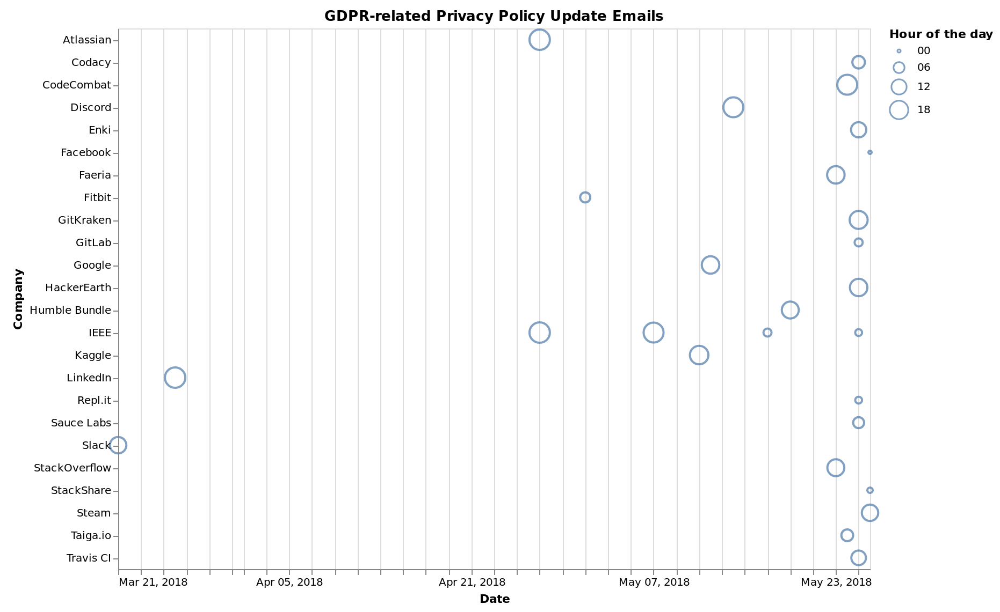

About the Data
--------------

This visualization was inspired by the
[plot](https://www.reddit.com/r/dataisbeautiful/comments/8m8gx7/number_of_email_i_received_regarding_privacy/)
that Reddit user [koljam](https://www.reddit.com/user/koljam) made of
the privacy policy update emails that they recieved from companies
preparing for the new
[GDPR](https://en.wikipedia.org/wiki/General_Data_Protection_Regulation)
regulation in EU law. As koljam noted, many companies waited til the
last day before the legislation came into effect to send emails about
their privacy policy updates. For fun I wanted to try making a similar
visualzation to koljam's with the GDPR emails in my my own inbox.

I collected the data by manually looking through my inbox for the past
month to find any emails related to privacy policy updates. I also
augmented this by searching specifically for "GDPR" and "privacy policy"
and filtering that down to actual privacy policy updates, ignoring
references to GDPR in newsletters.

The raw data is available at the following link (CC BY 4.0):
[gdpr\_emails.csv](gdpr_emails.csv)

koljam looked at the number of GDPR emails that they recieved on each
day as GDPR approached. I decided to also look at when different
companies sent out GDPR emails and what time of day they sent the emails
out on.

Some interesting things:

-   Slack was the first company to send me a GDPR email, sending it on
    March 21st (2018). The email was quite early and did mention
    GDPR specifically. LinkedIn also gets a favorable mention.
-   Some stragglers were Facebook, StackShare, and Steam. With Facebook
    sending the email at 11:45 pm on May 25th, StackShare sending their
    email at 12:34 am on May 26th, and Steam at 1:56 pm on May 26th.
-   IEEE sent me 4 separate emails asking me to review and accept their
    privacy policy. The first one to specifically mention GDPR was the
    second one (May 7), so perhaps the first one could have been
    unrelated to GDPR.
-   I recieved a total of 10 GDPR emails on May 25th, the day GDPR
    was implemented. This dwarfed all other days, which had at most 2
    GDPR emails. This agrees with koljam's findings.

About the Visualization
-----------------------

I created this data visualization using the
[Vega-Lite](https://vega.github.io/vega-lite/) Javascript library. I
also got some ideas of what to plot, and generated some of the Vega-Lite
spec, by using the [Voyager 2](https://vega.github.io/voyager/) data
visualization tool
([paper](https://idl.cs.washington.edu/papers/voyager2/)).

Feel free to play around with and modify the visualization. All of the
code for this webpage is available under the MIT License.

Notes
-----

For some reason the GDPR email sent by Facebook is shown visually as
being on May 26th, while it was actually on the 25th (this is shown when
you hover over the point). I think this is due to the rounding used in
generating the plot, since the email was sent at 11:45pm which probably
rounded up to midnight of the morning of the 26th.
